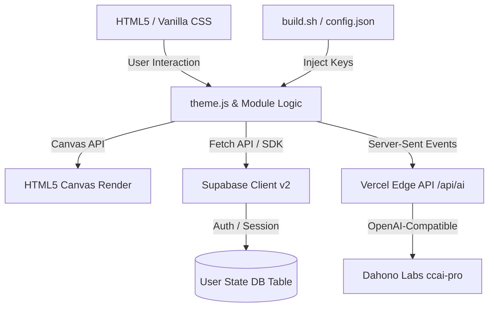

# AI Math Lab

**AI Math Lab** is an interactive, browser-based visual laboratory designed to build deep, geometric intuition for the core mathematical principles underlying modern artificial intelligence and machine learning. 

The project is built entirely using **pure HTML, vanilla CSS, and vanilla JavaScript**, with **no frontend frameworks or libraries**. It runs directly in the browser, offering rapid performance, a premium glassmorphic/responsive UI, and advanced features like multi-language localization and cross-device state synchronization.

---

## Key Features

*   **Real-Time Math Visualization**: Interactive vector spaces, matrix warping grids, dynamic calculus curves, probability distributions, and live neural network training.
*   **Advanced Context-Aware AI Tutor**: Intelligent assistant powered by Dahono Labs `ccai-pro` model. Features live markdown rendering, MathJax equations, multilingual Text-to-Speech (TTS), and the ability to physically highlight UI elements (`[[HIGHLIGHT]]`) and annotate the interactive canvas (`[[ANNOTATE]]`).
*   **Internationalization (i18n)**: Native multilingual support in **English (`en`)**, **Japanese (`ja`)**, and **Indonesian (`id`)** with instant, client-side DOM swapping.
*   **Cross-Device State Sync**: Integrated with **Supabase Authentication and Database** to save and restore interactive inputs, active tabs, custom matrices, and vectors in real-time.
*   **Adaptive Dark/Light Theme**: Sleek dark and light modes utilizing CSS variables, matching system preferences automatically and synchronizing canvas colors smoothly.
*   **Premium Mathematical Rendering**: High-quality inline formula layout powered by MathJax.
*   **Zero Frameworks**: Built without React, Vue, Angular, or any build/bundling tools. Deploys directly as a highly optimized static site onto platforms like Vercel.

---

## Visual Modules

The lab is split into five core interactive modules, complemented by a scientific methodology directory:

### 1. Vectors (`vector.html`)
Explore vector arithmetic and linear algebra concepts in both 2D and 3D spaces:
*   **Interactive Coordinates**: Add/remove vectors, edit values, and dynamically zoom.
*   **Linear Combinations**: Scalable controls showing how linear scaling forms vectors.
*   **Geometric Concepts**: Toggle visualizations for **Resultant Vectors**, **Vector Span**, **Projection / Dot Product**, and **Cross Product** (in 3D mode).
*   **3D Space Rotation**: Orbit/rotate the 3D canvas via dragging or auto-orbit.

### 2. Matrices (`matrix.html`)
Witness how matrices act as space-warping functions:
*   **Transform Grid**: Observe unit basis vectors $\hat{i}$ and $\hat{j}$ land on custom coordinates.
*   **Linear Map Explorer**: Step-by-step visual dissection of matrix multiplication showing how $Av$ is a scaled sum of the matrix's columns.
*   **Decompositions & Operators**: Live computation of **Determinant**, **Trace**, and **Rank**.
*   **Eigenvectors & Eigenvalues**: Highlights invariant directions with exact numeric values.
*   **SVD Animation**: Step-by-step animation of **Singular Value Decomposition** ($A = U\Sigma V^T$).
*   **Presets & Composition**: Preloaded transformations (Identity, 90° Rotation, Shear, Reflection, Stretch) and composition of multiple transformations ($B \times A$).

### 3. Calculus (`calculus.html`)
Demystify the mathematical engine powering machine learning training:
*   **Derivatives & Integrals**: Visualize instantaneous tangent lines and area approximation under curves.
*   **Taylor Series**: Move degree sliders to see how polynomial approximations align with complex functions.
*   **Gradient Descent**: Trace optimization paths in real-time on **1D Cost Functions** or **2D Loss Contours** (3D landscape visualization).

### 4. Probability (`probability.html`)
Build intuition around modeling uncertainty in AI:
*   **Distribution Explorer**: Adjust parameters for **Normal** and **Multivariate Normal** distributions.
*   **Central Limit Theorem (CLT)**: Roll virtual dice to watch sums converge into a bell curve.
*   **Probability Theory**: Interactive representations of **Bayes' Theorem**, **Binomial Distribution**, and **Markov Chains**.

### 5. Neural Networks (`neural.html`)
Train and inspect a live artificial neural network in your browser:
*   **MLP Flow & Backpropagation**: Trace the forward pass, calculate error, and propagate gradients backward step-by-step.
*   **Decision Boundaries**: Train a model on custom datasets and watch the classification boundary morph.
*   **Activation Functions**: Compare ReLU, Sigmoid, and Tanh curves side-by-side.
*   **Single Perceptron**: Learn binary classification with interactive weight adjusting.

### Scientific Methodology & References (`references.html`)
Bridges interactive visualizers with real-world AI applications:
*   Detailed connections between vectors and **Word Embeddings / Attention Mechanisms**, matrices and **LoRA / Weight Tensors**, calculus and the **Adam Optimizer**, and probability and **Diffusion Models**.
*   Academic citations referencing foundational texts and papers (Strang, Goodfellow, Vaswani, Mikolov, etc.).

---

## Architecture & Tech Stack

*   **Frontend**: Pure HTML5 / Canvas API, CSS Variables, Vanilla ES6+ JavaScript.
*   **Math Rendering**: MathJax 3.
*   **AI Backend**: OpenAI-compatible streaming API hitting a Vercel Edge Function (`/api/ai.js`) powered by the Dahono Labs API Gateway.
*   **Backend / Persistence**: Supabase JS SDK v2 (Authentication & Upsert for `user_states`).
*   **Deployment**: Vercel (Static site output mapping to `/public` directory).

---

## Installation & Setup

Since this is a vanilla HTML and JavaScript project, no installation, dependencies, or build steps are required. 

You can run the project locally by simply opening the `index.html` file directly in your web browser.

---

## Deployment Configuration

The site is built and deployed using `vercel.json` and `build.sh`.

*   **Build Script (`build.sh`)**:
    *   Creates a `public` directory.
    *   Copies all assets (`*.html`, `*.css`, `*.js`, `*.png`, `*.svg`) to `public/`.
    *   Injects the deployment's environment variables (`$SUPABASE_URL` and `$SUPABASE_ANON_KEY`) into `public/config.js` and `public/config.json`.
*   **Vercel Config (`vercel.json`)**:
    *   Sets the build command to `bash build.sh`.
    *   Sets the output directory to `public`.

---

## Acknowledgements

Created by **Rico Eriansyah**. Inspired by the educational approaches of:
*   **3Blue1Brown** (Grant Sanderson)
*   **Gilbert Strang** (MIT Linear Algebra)
*   **Christopher Bishop** (Pattern Recognition and Machine Learning)
*   **Michael Nielsen** (Neural Networks and Deep Learning)

Special thanks to **[Dahono Labs](https://labs.dahono.com)** for providing the `ccai-pro` model and API Gateway that powers the interactive AI Tutor.

---

## License

This project is licensed under the MIT License - see the [LICENSE.md](LICENSE.md) file for details.
