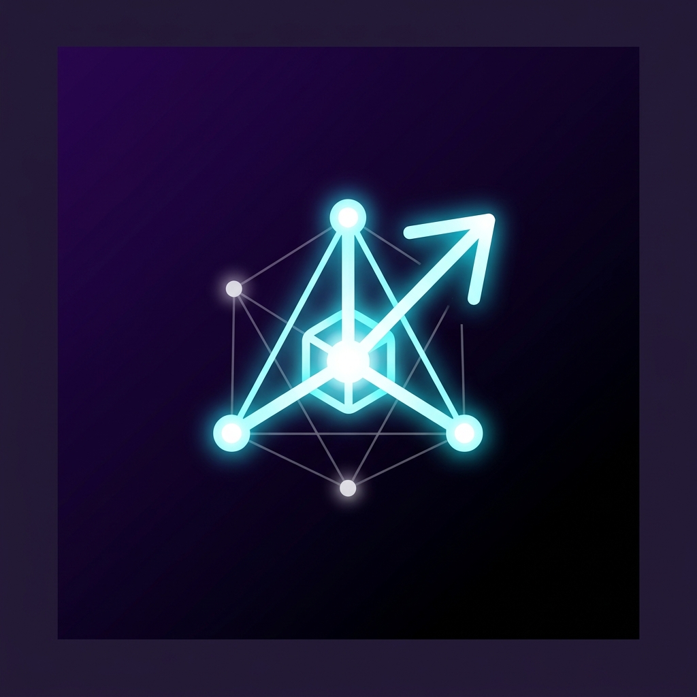

# AI Math Lab

AI Math Lab is a collection of interactive visualizers designed to help you build intuition for the core mathematics behind artificial intelligence and machine learning. 

It runs entirely in the browser using HTML5 Canvas and vanilla JavaScript.

## Modules

The project is split into five interactive modules:

1. **Vectors**: Visualizations for magnitude, direction, linear combinations, spans, and basis vectors in 2D and 3D.
2. **Matrices**: Interactive demos showing how matrices act as linear transformations, including determinants and eigenvectors.
3. **Calculus**: Step-by-step breakdowns of derivatives, integrals, and how gradient descent actually works.
4. **Probability**: Explorations of normal distributions, Bayes' theorem, and the Central Limit Theorem.
5. **Neural Networks**: A browser-based neural network where you can observe the forward pass, activation functions, and backpropagation in real time.

## Running Locally

There are no build steps or dependencies. You can run the project locally by simply opening `index.html` directly in your web browser. 

Alternatively, if you use a code editor like VS Code, you can use the "Live Server" extension for a better development experience.

## Acknowledgements

Created by Rico Eriansyah. Inspired by the educational approaches of 3Blue1Brown, Gilbert Strang, Christopher Bishop (PRML), and Michael Nielsen (Neural Networks and Deep Learning).

## License

This project is licensed under the MIT License - see the [LICENSE.md](LICENSE.md) file for details.
